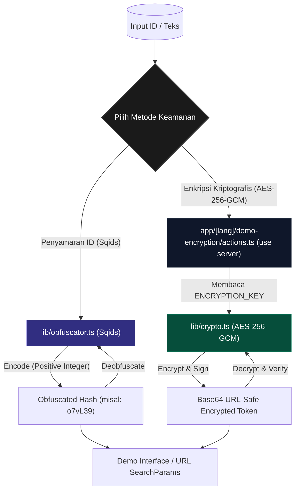

# 🚀 Init Next.js App — Amir App

Selamat datang di **Amir App**, template Next.js 16 modern berbasis **React 19**, **Tailwind CSS v4.3**, dan **TypeScript 6 (Strict Mode)** dengan dukungan Progressive Web App (PWA) serta integrasi i18n native berkecepatan tinggi. 

Repositori ini telah dioptimalkan secara mendalam menggunakan **Bun** sebagai pengelola paket, konfigurasi **ESLint v9**, serta dilengkapi dengan **ID Security Suite** bawaan untuk pengamanan identitas data Anda.

---

## 📊 Arsitektur Pengamanan ID (ID Security Suite)

Berikut adalah visualisasi alur pemrosesan data pada dua fitur keamanan utama (Sqids & AES-256-GCM) yang terintegrasi di dalam template ini:



---

## ✨ Fitur Utama

1. **Next.js 16.2.6 (App Router)** & **React 19**: Memanfaatkan fitur rendering server tercepat secara bawaan (*Server Components by default*).
2. **Tailwind CSS v4.3**: Dukungan styling modern berbasis variabel CSS `@theme inline` untuk kecepatan pengembangan optimal.
3. **Serwist PWA v9.5**: Dukungan service worker luring (*offline-first*) yang tangguh untuk mempermudah distribusi aplikasi seluler progresif.
4. **Native i18n Dictionaries**: Sistem lokalisasi native berbasis segmentasi rute dinamis `[lang]` dengan performa ekstra cepat tanpa dependensi tambahan yang berat.
5. **ID Security Suite**:
   * **Sqids Obfuscation**: Mengubah ID integer database (auto-increment) menjadi hash unik ramah URL untuk menyembunyikan detail sensitif database.
   * **AES-256-GCM Cryptography**: Enkripsi dua arah terautentikasi (*tamper-proof*) berbasis server untuk menjaga privasi data sensitif seperti UUID atau string transaksi.
6. **Continuous Integration (CI)**: Pipeline GitHub Actions otomatis untuk mendeteksi error linter dan memverifikasi build aplikasi pada setiap Pull Request ke cabang `master`.

---

## 📁 Struktur Folder Utama

```
Init-nextjs-app/
├── .github/workflows/         # Pipeline CI GitHub Actions
│   └── ci.yml                 # Alur otomatis Lint & Build
├── app/                       # Next.js App Router (Semua Rute)
│   ├── [lang]/                # Segmentasi Bahasa Dinamis (i18n)
│   │   ├── demo-encryption/   # Fitur & Tampilan Demo Keamanan ID
│   │   │   ├── actions.ts     # Server Actions (use server)
│   │   │   ├── DemoClient.tsx # Komponen Interaktif Klien
│   │   │   └── page.tsx       # Halaman utama demo (Server Component)
│   │   ├── dictionaries.ts    # Pemuat berkas i18n
│   │   ├── layout.tsx         # Layout i18n dengan metadata SEO
│   │   └── page.tsx           # Halaman Utama
│   ├── globals.css            # Pengaturan CSS & Tema Tailwind v4
│   ├── manifest.ts            # Manifest PWA
│   └── sw.ts                  # Skrip Service Worker (Serwist)
├── dictionaries/              # Berkas Terjemahan Bahasa (JSON)
│   ├── id.json                # Bahasa Indonesia (Bawaan)
│   └── en.json                # Bahasa Inggris
├── lib/                       # Utilitas Pendukung Bersama
│   ├── crypto.ts              # Modul enkripsi AES-256-GCM (Server-Only)
│   ├── obfuscator.ts          # Modul penyamaran ID Sqids
│   └── seo.ts                 # Utilitas JSON-LD & SEO
├── proxy.ts                   # Pendeteksi locale & pengarah otomatis (ganti Middleware)
├── .env                       # Variabel environment umum
├── .env.development            # Konfigurasi dev lokal (tidak di-commit)
├── .env.production             # Konfigurasi produksi (tanpa rahasia)
└── package.json               # Dependensi & skrip project
```

---

## 🛠️ Panduan Pengembangan

### Prasyarat
Pastikan Anda telah memasang **Bun** (≥ 1.3) di sistem lokal Anda.

### 1. Pemasangan Dependensi
Pasang seluruh paket pustaka dengan cepat menggunakan Bun:
```bash
bun install
```

### 2. Jalankan Mode Pengembangan
Jalankan server lokal untuk melihat hasil perubahan secara langsung:
```bash
bun run dev
```
Buka [http://localhost:3000](http://localhost:3000) di peramban Anda.

### 3. Pemeriksaan Linter (ESLint)
Pastikan kode Anda bebas dari error linter sebelum melakukan komit:
```bash
bun run lint
```

### 4. Build untuk Produksi
Verifikasi kelayakan kompilasi proyek Next.js Anda:
```bash
bun run build
```

---

## 🔒 Panduan Penggunaan ID Security Suite

### 1. Penyamaran ID (Sqids)
Cocok untuk mengubah angka ID database (seperti `10543`) menjadi hash string unik pendek seperti `o7vL39` untuk digunakan pada parameter URL tanpa menampilkan ID asli.

```typescript
import { obfuscateId, deobfuscateId } from "@/lib/obfuscator";

// Proses menyamarkan ID
const hash = obfuscateId(10543);
console.log(hash); // Output: "o7vL39" (panjang minimal 6 karakter)

// Proses mengembalikan ke ID asli
const originalId = deobfuscateId("o7vL39");
console.log(originalId); // Output: 10543
```

### 2. Enkripsi Kriptografis (AES-256-GCM)
Enkripsi terautentikasi super aman untuk mengenkripsi string sensitif secara bolak-balik menggunakan algoritma AES-256-GCM. Fitur ini dilindungi dengan pustaka `"server-only"` sehingga kunci rahasia (`ENCRYPTION_KEY`) tidak akan pernah bocor ke sisi klien peramban.

```typescript
// PENTING: Hanya dapat dipanggil di Server Components, Server Actions, atau API Routes
import { encrypt, decrypt } from "@/lib/crypto";

// Proses Enkripsi
const token = encrypt("user-1234-uuid-secret");
console.log(token); // Output: Base64 URL-Safe String terenkripsi

// Proses Dekripsi
const plainText = decrypt(token);
console.log(plainText); // Output: "user-1234-uuid-secret"
```

*Catatan: Jika token terenkripsi mengalami manipulasi karakter oleh peretas, proses dekripsi akan secara otomatis mendeteksi kegagalan otentikasi data dan mengembalikan nilai `null` secara aman untuk mencegah serangan injeksi.*

---

## 🚀 Konfigurasi Environment Variables

Template ini menggunakan sistem prioritas variabel lingkungan bawaan Next.js. Rahasia kriptografi diatur **tanpa** awalan `NEXT_PUBLIC_` untuk memastikan keamanan penuh di sisi server.

Salin berkas template `.env.example` menjadi `.env.local` untuk konfigurasi lokal Anda:
```bash
cp .env.example .env.local
```

### Variabel Utama:
* `ENCRYPTION_KEY`: Kunci rahasia berukuran **tepat 32 karakter** (256-bit) yang digunakan oleh modul AES-GCM.
* `SQIDS_ALPHABET`: Deretan karakter kustom yang digunakan oleh Sqids untuk mengacak hash URL yang dihasilkan.
